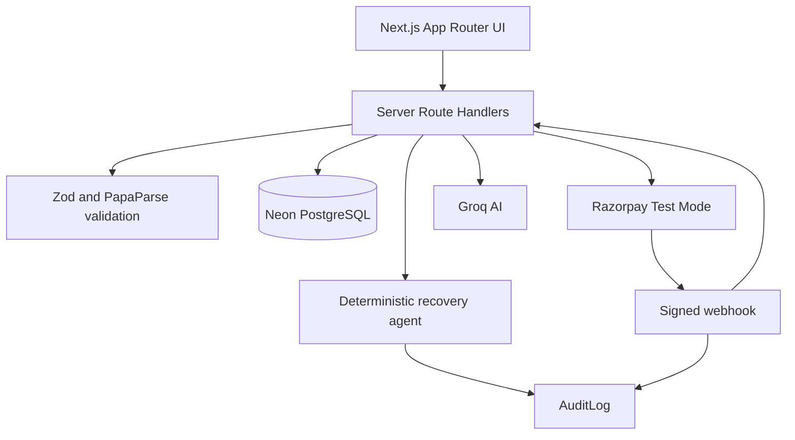

# RecoverAI
AI Revenue Recovery Agent for Razorpay merchants

Detect failed payments. Diagnose why they failed. Decide the next-best recovery action. Execute safely. Verify payment. Measure recovered revenue.

Detect → Diagnose → Decide → Act → Verify → Stop → Measure

RecoverAI is a safety-first AI revenue recovery operations platform for Razorpay merchants. It turns failed-payment records into explainable, prioritized recovery cases, asks for merchant approval where required, creates Razorpay Test Mode payment links, and verifies successful recovery through signed webhooks.

RecoverAI helps customers retry payments they owe to the merchant. It never sends money to customers and never autonomously charges a customer.

> Demo environment using fictional customer data and Razorpay Test Mode. No real payments or customer communications are performed.

## Product Story

```text
Failed Payment
      |
      v
CSV or Razorpay Webhook
      |
      v
Validate and normalize transaction
      |
      v
Store customer, transaction, and recovery case
      |
      v
Diagnose failure and calculate priority
      |
      v
Apply consent, attempt, risk, quiet-hour, and approval policies
      |
      v
Merchant approval when required
      |
      v
Razorpay Test Mode payment link
      |
      v
Customer retry message from Groq or deterministic fallback
      |
      v
Signed Razorpay webhook
      |
      v
Mark transaction and case recovered; cancel future actions
```

## Architecture



## Current Features

- Command Center with database-backed metrics and recovery charts.
- Recovery Queue with search, status filters, priority labels, probability bars, AI next action, and case links.
- CSV preview and confirmation workflow.
- Paise-based money storage and validation.
- Recovery case creation with transactional customer, transaction, action, and audit records.
- Case Intelligence page with diagnosis, policy checks, approval, rejection, stop, message generation, and payment-link controls.
- Deterministic recovery decision engine for UPI, card, bank, subscription, invoice, checkout, consent, fraud, and attempt-limit scenarios.
- Groq customer-message generation with strict Zod validation and deterministic fallback templates.
- Razorpay Test Mode payment-link creation with duplicate prevention and simulated demo links.
- Signed Razorpay webhook verification and idempotent recovery confirmation.
- Audit and Safety page with sanitized timeline and filters.
- Agent Control and Settings pages with manual controls and persisted policy settings.
- Honest integration status for Neon, Razorpay, Groq, and simulated communications.
- Responsive light fintech dashboard design.

## Technology Stack

- Next.js 16 App Router
- React 19
- TypeScript
- Tailwind CSS 4 and existing custom CSS
- PostgreSQL hosted on Neon
- Prisma 7 ORM with the PostgreSQL adapter
- Zod validation
- PapaParse CSV parsing
- Razorpay Node SDK
- Groq SDK
- Recharts
- Native Node crypto for webhook HMAC verification
- Vitest

## Requirements

- Node.js 20 or newer recommended
- npm
- A Neon PostgreSQL database for persistence
- Razorpay Test Mode credentials for real test links and webhooks
- Groq API key for live AI-generated messages; fallback templates work without it

## Installation

```powershell
npm install
Copy-Item .env.example .env.local
```

Edit `.env.local` with your own values. Never commit `.env.local` or paste secret values into source files.

Start the development server:

```powershell
npm run dev
```

Open `http://localhost:3000`. If port 3000 is already used:

```powershell
npm run dev -- -p 3001
```

## Environment Variables

```env
DATABASE_URL=
DIRECT_URL=

RAZORPAY_KEY_ID=
RAZORPAY_KEY_SECRET=
RAZORPAY_WEBHOOK_SECRET=

GROQ_API_KEY=
GROQ_MODEL=openai/gpt-oss-20b

NEXT_PUBLIC_APP_URL=http://localhost:3000

DEMO_MODE=true
MAX_RECOVERY_ATTEMPTS=3
APPROVAL_THRESHOLD_PAISE=1000000
```

Only `NEXT_PUBLIC_APP_URL` is intended for browser exposure. Database URLs, Razorpay secrets, webhook secrets, and Groq keys remain server-side.

## Neon and Prisma Setup

1. Create a Neon project.
2. Copy the pooled connection string into `DATABASE_URL`.
3. Copy the direct connection string into `DIRECT_URL`.
4. Run the migration:

```powershell
npx prisma generate
npx prisma migrate dev --name init
```

5. Seed fictional demo records:

```powershell
npx prisma db seed
```

6. Inspect records with Prisma Studio:

```powershell
npx prisma studio
```

The Prisma schema is in [prisma/schema.prisma](prisma/schema.prisma). Money is stored as integer paise. For example, INR 2,499 is stored as `249900`.

Useful scripts:

```powershell
npm run db:generate
npm run db:validate
npm run db:migrate
npm run db:seed
npm run db:studio
```

## CSV Import

The sample file is [public/sample-failed-transactions.csv](public/sample-failed-transactions.csv).

Required columns:

```csv
transaction_id,customer_name,email,phone,amount_rupees,payment_method,failure_reason,error_code,error_step,error_source,attempts,previous_successes,consent_email,consent_sms,consent_whatsapp,occurred_at
```

Import behavior:

1. Select a CSV file from the Import Transactions page.
2. The server checks file type and the 2 MB size limit.
3. Headers are normalized and every row is validated with Zod.
4. Rupees are converted to integer paise.
5. Invalid rows and duplicate IDs are shown before saving.
6. Confirm the preview explicitly.
7. The server revalidates the submitted rows.
8. Customers, transactions, recovery cases, actions, and audit logs are created in one database transaction.
9. Existing transaction IDs are skipped safely.
10. The app redirects to the Recovery Queue after a successful commit.

API endpoints:

- `POST /api/import/preview`
- `POST /api/import/commit`

Uploaded CSV contents are not stored as permanent files.

## Recovery Decision Engine

The deterministic agent is in [src/lib/recovery-agent.ts](src/lib/recovery-agent.ts). It produces a priority score, recovery probability, recommended action, delay, approval requirement, stop decision, and explanation.

Supported strategies include:

- Expired UPI request: create a fresh payment link.
- Incorrect OTP: offer a secure retry option.
- Bank timeout: wait before an alternative method.
- Insufficient funds: send a delayed low-pressure reminder.
- Expired card: offer another payment method.
- Card decline: offer an alternative payment method.
- Checkout abandonment: allow one low-pressure reminder.
- Subscription or invoice failure: use a measured retry/reminder path.
- Suspected fraud: stop and escalate.
- Missing consent: do not contact.
- Already paid or maximum attempts: stop recovery.

The agent never exposes private chain-of-thought reasoning. The UI displays concise decision explanations and policy outcomes only.

## Safety Rules

- Stop after verified payment.
- Stop for customer opt-out or missing consent.
- Stop after three attempts by default.
- Stop or escalate suspected fraud.
- Respect quiet hours from 9 PM to 9 AM.
- Require merchant approval for high-value cases.
- Never request OTP, CVV, PIN, passwords, or full card data.
- Never autonomously charge a customer.
- Never claim payment success without a verified provider event.
- Cancel pending actions after successful payment.
- Store sanitized audit snapshots and never expose secrets.

The default approval threshold is `1000000` paise, equal to INR 10,000.

## Razorpay Test Mode

Configure:

```env
RAZORPAY_KEY_ID=your_test_key_id
RAZORPAY_KEY_SECRET=your_test_key_secret
RAZORPAY_WEBHOOK_SECRET=your_webhook_secret
```

Payment-link behavior:

- Existing valid links are reused.
- Recovered and stopped cases cannot create new links.
- Approval is required when the case policy requires it.
- Missing credentials with `DEMO_MODE=true` produce clearly labelled simulated links.
- Simulated links never charge anyone and are never presented as real Razorpay links.

Webhook endpoint:

```text
POST /api/webhooks/razorpay
```

The endpoint reads the raw body, verifies `x-razorpay-signature` using HMAC-SHA256, stores webhook events idempotently, validates the recovered amount, marks the case recovered, cancels pending actions, and writes an audit entry.

Supported paid events include `payment.captured`, `order.paid`, `payment_link.paid`, `subscription.charged`, and `invoice.paid`.

## Groq AI Messages

Configure:

```env
GROQ_API_KEY=your_groq_key
GROQ_MODEL=llama-3.3-70b-versatile
```

Groq is used only for customer-friendly failure explanations, personalized recovery messages, and case summaries.

Responses must be JSON and are validated with Zod:

```json
{
  "customerMessage": "",
  "caseSummary": "",
  "failureExplanation": ""
}
```

When the key is missing, the API fails, the model returns invalid JSON, or validation fails, RecoverAI uses deterministic fallback templates. No customer communication is sent automatically.

Test the configured integration:

```powershell
npx tsx scripts/test-groq.ts
```

## Application Routes

| Route | Purpose |
| --- | --- |
| `/` | Command Center |
| `/import` | CSV preview and commit |
| `/recovery-queue` | Searchable recovery case queue |
| `/cases/[id]` | Case Intelligence and actions |
| `/agent-control` | Manual agent controls and policies |
| `/audit` | Audit and Safety timeline |
| `/integrations` | Provider and database status |
| `/settings` | Workspace policy settings |

## API Routes

| Method | Endpoint | Purpose |
| --- | --- | --- |
| `GET` | `/api/dashboard` | Dashboard metrics |
| `POST` | `/api/import/preview` | Validate and preview CSV |
| `POST` | `/api/import/commit` | Persist validated import |
| `GET` | `/api/recovery-cases` | List recovery cases |
| `GET` | `/api/recovery-cases/[id]` | Load one case |
| `POST` | `/api/recovery-cases/[id]/approve` | Approve recovery |
| `POST` | `/api/recovery-cases/[id]/reject` | Reject and stop recovery |
| `POST` | `/api/recovery-cases/[id]/stop` | Stop recovery |
| `POST` | `/api/recovery-cases/[id]/message` | Generate a message |
| `POST` | `/api/recovery-cases/[id]/payment-link` | Create or reuse a payment link |
| `POST` | `/api/webhooks/razorpay` | Verify and process Razorpay events |
| `GET` | `/api/audit` | Load sanitized audit events |
| `GET` | `/api/integrations` | Load integration status |
| `GET/PATCH` | `/api/agent-settings` | Load or save agent policies |

All API responses use:

```json
{
  "success": true,
  "data": {},
  "error": null
}
```

## Demo Walkthrough

1. Run the database migration and seed.
2. Open the Command Center.
3. Review live revenue-at-risk and case metrics.
4. Open Recovery Queue.
5. Open `CASE-1048`.
6. Review diagnosis, priority, probability, and policy checks.
7. Generate a Groq or fallback customer message.
8. Approve a persisted case when required.
9. Create a Razorpay Test Mode or clearly simulated payment link.
10. Complete the test payment if Razorpay is configured.
11. Send a signed webhook event.
12. Confirm the case becomes `RECOVERED` and pending actions are cancelled.
13. Review the audit timeline.

## Testing and Verification

Run unit and security tests:

```powershell
npm test
```

Run all static checks:

```powershell
npm run lint
npx tsc --noEmit
npm run build
```

The test suite covers recovery decisions, high-value approval, consent and fraud stopping rules, CSV validation and paise conversion, duplicate IDs, and Razorpay webhook signature verification.

## Project Structure

```text
src/
  app/
    page.tsx                         Command Center
    import/                          CSV import page
    recovery-queue/                  Recovery Queue
    cases/[id]/                       Case Intelligence
    agent-control/                   Agent controls
    audit/                           Audit and Safety
    integrations/                    Integration status
    settings/                        Workspace settings
    api/                             Server route handlers
  components/                        Interactive UI components
  lib/
    ai/                              Groq and fallback messages
    import/                          CSV normalization and validation
    razorpay/                        Payment links and webhooks
    recovery-agent.ts                Deterministic decision engine
    prisma.ts                        Prisma singleton
    dashboard.ts                     Dashboard aggregation
    audit.ts                         Sanitized audit reads
prisma/
  schema.prisma                      PostgreSQL data model
  seed.ts                            Fictional demo seed
tests/                               Vitest tests
public/                              Sample CSV and static assets
```

## Deployment

RecoverAI is designed for Vercel + Neon + Razorpay Test Mode + Groq.

Before deployment:

1. Create a production Neon database.
2. Configure server environment variables in Vercel.
3. Run the Prisma migration against the production database.
4. Do not seed fictional data into production unless intentionally creating a demo environment.
5. Set `NEXT_PUBLIC_APP_URL` to the deployed URL.
6. Configure the Razorpay webhook URL as `https://your-domain.example/api/webhooks/razorpay`.
7. Confirm webhook signature verification.
8. Run `npm run build` locally and in CI.
9. Test CSV import, payment links, and webhook recovery in Razorpay Test Mode.

The application does not rely on filesystem persistence and is compatible with Vercel server routes.

## Known Limitations

- Communications are simulated; no email, SMS, or WhatsApp provider is connected.
- Groq is optional and falls back to deterministic templates.
- Razorpay payment links are simulated when credentials are absent and demo mode is enabled.
- Agent Control is intentionally manual; there is no uncontrolled background worker.
- Authentication and multi-tenant authorization are not implemented yet.
- Live webhook testing requires a publicly reachable deployment or webhook tunnel.

## Future Enhancements

- Merchant authentication and role-based access control.
- Tenant/workspace isolation.
- Real communication providers with consent-aware delivery logs.
- Background job scheduling for delayed actions.
- Webhook replay and dead-letter tooling.
- Case-level message editing and communication history.
- Production observability, rate limiting, and alerting.

## License

This project is private and intended for the RazorPay hackathon/product demonstration environment.
